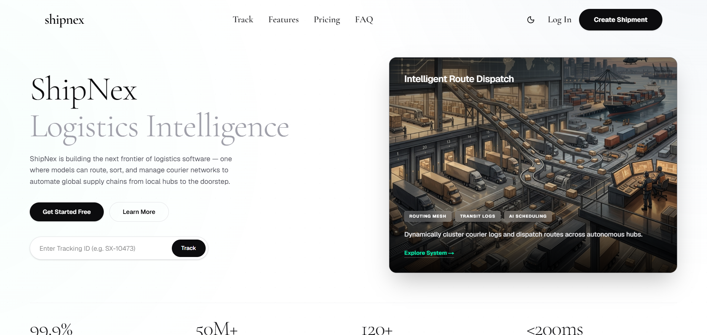
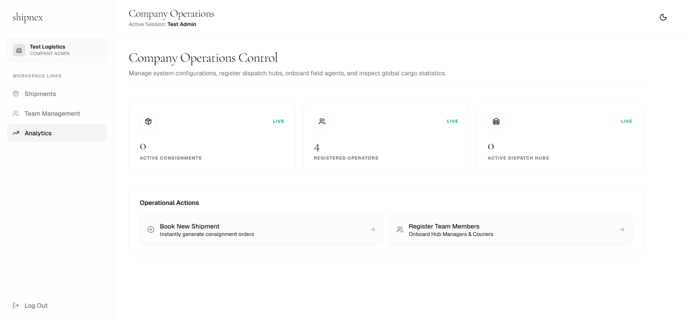
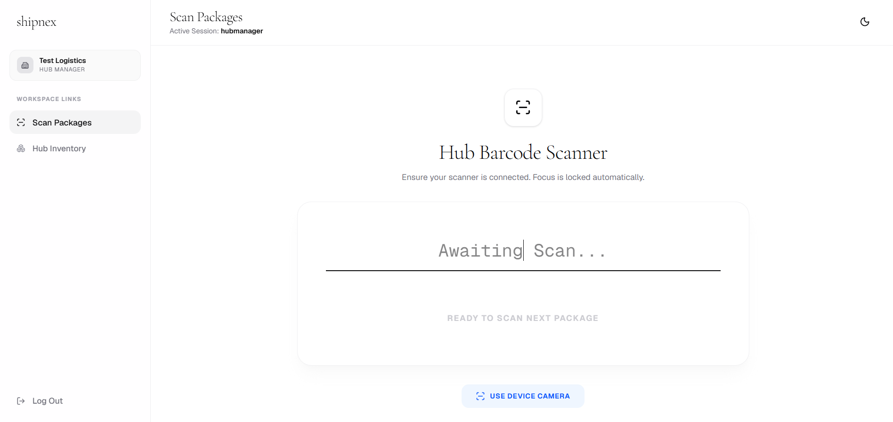
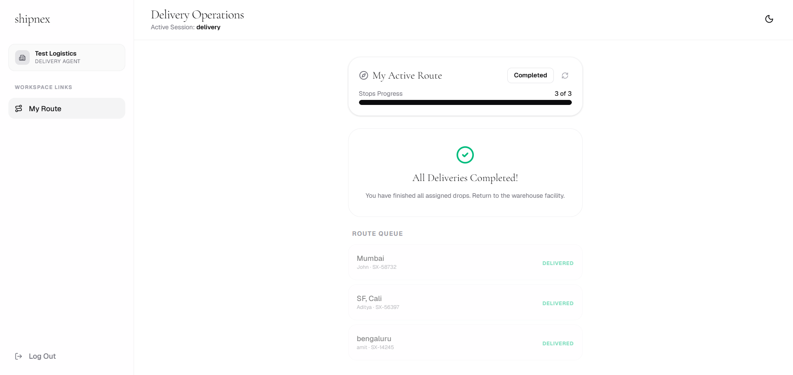

# ShipNex 


ShipNex is a comprehensive, modern logistics and courier management platform. It offers a powerful ecosystem of tools designed for Company Admins, Hub Managers, and Delivery Drivers to track, sort, and deliver packages seamlessly.

## 🌟 Key Features

- **Company Admin Portal:** Manage shipments, oversee your team, and view system-wide analytics.
- **Hub Manager Station:** Scan incoming parcels via QR/Barcodes and manage local inventory routing.
- **Delivery Driver App:** View daily route queues, update package statuses on the go, and upload Proof of Delivery (POD).
- **Public Tracking:** A beautiful, responsive tracking page for end-customers to see real-time updates.
- **Multi-Tenant System:** Scalable architecture supporting multiple courier organizations simultaneously.
- **Super Admin Oversight:** A specialized role for platform owners to register and manage tenants.

---

## 📸 Screenshots

*(Add your screenshots to the `public/screenshots/` folder and they will appear here)*
| Public Landing Page | Company Admin Dashboard |
| :---: | :---: |
|  |  |
| *Modern public tracking and marketing site* | *Manage shipments, team roles, and platform metrics* |

| Hub Barcode Scanner | Delivery Driver App |
| :---: | :---: |
|  |  |
| *Fast, camera-based local sorting logic* | *Live route tracking and Proof of Delivery (POD)* |

---

## 🛠 Tech Stack

**Frontend:**
- **Language:** TypeScript & JavaScript
- **Framework:** Next.js 15 (App Router)
- **Styling:** Tailwind CSS + Framer Motion (for animations)
- **Icons:** Lucide React
- **QR/Barcode Scanning:** `html5-qrcode` (Reads both 2D QR codes and 1D Barcodes directly from device camera)

**Backend:**
- **Language:** TypeScript & JavaScript
- **Framework:** Node.js / Express
- **Database:** MongoDB (Managed via Prisma ORM)
- **Authentication:** JWT (JSON Web Tokens) & bcryptjs
- **File Uploads:** Multer

---

## 🚀 Getting Started

### Prerequisites
- Node.js (v18+)
- MongoDB connection string

### 1. Clone & Install
Install dependencies for both the frontend and backend.

```bash
# Install backend dependencies
cd backend
npm install

# Install frontend dependencies
cd ../frontend
npm install
```

### 2. Environment Variables
Create a `.env` file in the `backend` folder:
```env
PORT=5000
DATABASE_URL="mongodb+srv://<username>:<password>@cluster0.mongodb.net/shipnex?retryWrites=true&w=majority"
JWT_SECRET="your_super_secret_key"
```

Create a `.env.local` file in the `frontend` folder:
```env
NEXT_PUBLIC_API_URL="http://localhost:5000/api"
```

### 3. Run the Development Servers

Open two terminals.

**Terminal 1 (Backend):**
```bash
cd backend
npm run dev
```

**Terminal 2 (Frontend):**
```bash
cd frontend
npm run dev
```

Visit `http://localhost:3000` to view the application!

---

## 🔒 Roles & Access

ShipNex uses a unified login portal but routes users based on their assigned roles:
- **`superadmin`:** Platform management (must be created via API or DB).
- **`admin`:** Company management (can sign up via `/signup`).
- **`hub`:** Sorting facility management.
- **`delivery`:** Field delivery operations.

*(Hub Managers and Delivery Drivers must have their accounts created by their Company Admin).*

## 📄 License
This project is licensed under the MIT License.
